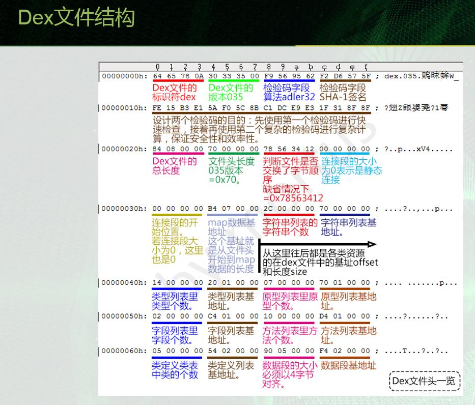

# 逆向分析代码
[http://www.androiddevtools.cn/](http://www.androiddevtools.cn/)
# 逆向工程



APKTOOL下载路径: [https://bitbucket.org/iBotPeaches/apktool/downloads/](https://bitbucket.org/iBotPeaches/apktool/downloads/)

adb shell tcpdump -p -vv -s 0 -w /sdcard/capture.pcap


Apk文件本质上其实是一个zip包。直接拿解压工具解压就可以看到其中包含了什么。下面简单介绍一下Apk文件的结构。
1. AndroidManifest.xml：应用的全局配置文件
1. assets文件夹：原始资源文件夹，对应着Android工程的assets文件夹，一般用于存放原始的网页、音频等等，与res文件夹的区别这里不再赘述，可以参考上面介绍的两篇文章。
1. classes.dex：源代码编译成class后，转成jar，再压缩成dex文件，dex是可以直接在Android虚拟机上运行的文件。
1. lib文件夹：引用的第三方sdk的so文件。
1. META-INF文件夹：Apk签名文件。
1. res文件夹：资源文件，包括了布局、图片等等。
1. resources.arsc：记录资源文件和资源id的映射关系。


# 逆向工程Git项目
https://github.com/pxb1988/dex2jar
https://github.com/google/android-classyshark
https://github.com/Juude/droidReverse
https://github.com/hammercui/android-reverse

# dex2jar的用法
[dex2jar](Android_RevertFile/dex2jar)
[jd-gui](Android_RevertFile/jd-gui)
命令:  d2j-dex2jar classes.dex

dex2jar
   作用：将apk反编译成Java源码（classes.dex转化成jar文件）

jd-gui
   作用：查看APK中classes.dex转化成出的jar文件，即源码文件


```
第一步：找到dex2jar和jd-gui两个文件

第二步：然后在把你需要反编译的apk包，后缀名改成zip，再解压，得到相应的解压文件

第三步：找到你解压后的文件里面的classes.dex文件，同时打开dex2jar-2.0文件夹，将classes.dex文件拷贝到dex2jar-2.0文件中

第四步：在dex2jar-2.0文件中shift+鼠标右键选择“在此处打开命令窗口（W）”，这样就进入到了dex2jar-2.0文件目录下，当然也可以自己通过cmd去指定dex2jar-2.0文件的路径，效果都是一样的

第五步：在此时的命令窗口中输入:d2j-dex2jar classes.dex 然后回车（注意：d2j-dex2jar和classes.dex之间在输入的时候有空格），执行完成后，会多出一个classes-dex2jar.jar文件，这个文件就是我们需要的

第六步：找到你下载的zip包解压后文件中的jd-gui文件夹，然后打开里面有jd-gui.exe文件,可以双击直接打开，然后，右上角 File —>Open File，将上面得到的classes-dex2jar.jar文件打开，就会得到我们最终想要的到的东西。
里面有别人引用的jar包，也有别人自定义项目工程的包，反正各种【代码资源】都在这了，【图片声音资源这里得不到的】，不过在第一次，你将apk后缀名改成zip解压后得到的解压文件里面就可以拿到别人的资源了
```

# enjarify 的使用 
把dex转换成jar已经有了比 dex2jar 更好的工具 enjarify
[地址: https://github.com/Storyyeller/enjarify](https://github.com/Storyyeller/enjarify)
使用命令 : python -O -m enjarify.main yourapp.apk    【paython需要为3以上版本】   生成 jar文件
```
python -O -m enjarify.main yourapp.apk

```

# ClassyShark 的使用
ClassyShark 作用:   能把 APK文件 解析出来并显示在UI上 【java 实现的UI上 】 并统计所有资源 方法数量 文件数量
命令:   
java ­jar ClassyShark.jar ­export b.apk   // 生成APK分析文件   method_counts.txt 【方法树形统计文本】  2.all_methods.txt  【所有方法名统计】  3.all_strings.txt 【所有字符串资源统计】
// 4. all_classes.txt  【所有类名的统计】    5.  AndroidManifest.xml_dump  【APK配置文件】
java -jar ClassyShark.jar -open 2.apk      // 解析APK 显示 smail文件  并统计数量
java -jar ClassyShark.jar -methodcounts b.apk    // 以字符串形式显示APK文件结构
java -jar ClassyShark.jar -inspect b.apk   // 分析APK中包含的方法数量 以及监听事件


**java ­jar ClassyShark.jar ­export b.apk**


**java -jar ClassyShark.jar -open b.apk **


**java -jar ClassyShark.jar -methodcounts b.apk **
```
java -jar ClassyShark.jar -methodcounts b.apk 
Parsing classes.dex
Parsing classes2.dex
Parsing classes3.dex
Parsing classes4.dex
b.apk - 160262   【当前文件中包含的方法数量】
 ╠═com - 46468  【各个文档中包含的文件类方法数量】
 ║ ╠═googlecode - 1104
 ║ ║ ╚═mp4parser - 1104
 ║ ║    ╠═boxes - 536
 ║ ║    ║ ╠═mp4 - 228
 ║ ║    ║ ║ ╠═a - 126
 
```

java -jar ClassyShark.jar -inspect b.apk   // 分析APK中包含的方法数量 以及监听事件
```
D:\gitrank\逆向\android-classyshark-master>java -jar ClassyShark.jar -inspect b.apk
Picked up _JAVA_OPTIONS: -Xmx512M

                  ~ APK DASHBOARD ~

+-------------------+------------------------------------------------------------------------------------------------------------------------------------+
| Recommendation    | Description                                                                                                                        |
+-------------------+------------------------------------------------------------------------------------------------------------------------------------+
|                   |                                                                                                                                    |
| classes.dex       | 65324 methods                                                                                                                      |
| classes2.dex      | 65236 methods                                                                                                                      |
| classes3.dex      | 65123 methods                                                                                                                      |
| classes4.dex      | 21262 methods                                                                                                                      |
|                   |                                                                                                                                    |
|                   |                                                                                                                                    |
| System Broadcast  | android.intent.action.DOWNLOAD_COMPLETE ==> com.bilibili.ad.adview.web.apkdownload.ApkMgr$ApkDownloadReceiver                      |
| System Broadcast  | android.intent.action.MEDIA_BUTTON ==> tv.danmaku.biliplayer.features.headset.HeadsetControlPlayAdapter$HeadsetMediaButtonReceiver |
| System Broadcast  | android.net.conn.CONNECTIVITY_CHANGE ==> com.xiaomi.push.service.receivers.NetworkStatusReceiver                                   |
|                   |                                                                                                                                    |
+-------------------+------------------------------------------------------------------------------------------------------------------------------------+

```
# Baksmali 的使用
[Baksmali/Smail 下载地址: https://bitbucket.org/JesusFreke/smali/downloads/](https://bitbucket.org/JesusFreke/smali/downloads/)
[Smail](Android_RevertFile/baksmali-2.2.2.jar)
[Baksmali](Android_RevertFile/baksmali-2.2.2.jar)

作用:  这2个jar包的作用就是将dex文件与smali文件格式进行互相转换。  要使用jar，首先需要配置Java环境

Baksmali 使用命令:  把 dex文件 转为 smail 文件内容
java -jar baksmali-2.2.2.jar d  dex文件 【 classes.dex 】    // dex文件为apk解压缩后的文件
java -jar baksmali-2.2.2.jar d classes.dex  


Smail使用命令:  把  smail 文件内容 转为 dex文件  
java -jar smali-2.2.2.jar a out   // 其中out 为 smail根文件夹    命令会生成 out.dex 文件夹


# apktool 的 使用
作用: 主要查看res文件下xml文件、AndroidManifest.xml和图片。（注意：如果直接解压.apk文件，xml文件打开全部是乱码）
[apktool](Android_RevertFile/apktool)
[下载地址： https://ibotpeaches.github.io/Apktool/install/](https://ibotpeaches.github.io/Apktool/install/)
下载文件：  apktool.bat       apktool_2.3.3.jar

命令:  apktool d app.apk    【 java -jar apktool.jar d yourApkFile.apk 】
```
使用方法:
1. 将下载的 apktool_2.3.3.jar  名字改为  apktool.jar
2. 运行CMD，把 app.apk放到所在目录，然后运行apktool d app.apk 【apk文件名字】就可以了，默认解压的文件就在app-release.apk所在目录。
  例如 [ apktool d bibibi.apk ]


java -jar apktool.jar d yourApkFile.apk
// 注意`apktool.jar`是刚才下载后的jar的名称，`d`参数表示decode
// 在这个命令后面还可以添加像`-o -s`之类的参数，例如
// java -jar apktool.jar d yourApkFile.apk -o destiantionDir -s
// 几个主要的参数设置方法及其含义：
-f 如果目标文件夹已存在，强制删除现有文件夹
-o 指定反编译的目标文件夹的名称（默认会将文件输出到以Apk文件名命名的文件夹中）
-s 保留classes.dex文件（默认会将dex文件解码成smali文件）
-r 保留resources.arsc文件（默认会将resources.arsc解码成具体的资源文件）
```


# Smali2JavaUI 的使用 
作用 :  直接把  classes.dex --> classes.jar ---> classes（包含java文件）
Smali2JavaUI 能直接完成这个操作     dex2jar不能直接完成 转为java文件的操作
[Smali2Java](Android_RevertFile/Smali2Java)
```
smali2java是一个将smali代码反编译成java代码的工具。
什么是smali？smali是将Android字节码用可阅读的字符串形式表现出来的一种语言，可以称之为Android字节码的反汇编语言。使用apktool可以将Android应用程序包（apk或jar）反编译为smali代码。

smali2java工具基于apktool v1.5.0（baksmali v1.3.4）生成的smali文件，依赖于smali文件中的代码行数（.line关键字）和变量别名（.local关键字）等信息，
可以最大程度还原原始的java代码。还原出的java代码将具有原始的变量命名，代码的顺序也与原始的java代码保持一致。因此，本工具也具有局限性，
仅适用于带有行数和变量别名信息的smali文件（java编译器的编译选项可以在生成的字节码中剔除这些信息）


对于先dex2jar把classes.dex转为jar，再jd-gui把jar转为源码*.java文件。
现在可以用Smali2JavaUI这个软件，一部到位。可以把这两个步骤化为一个步骤。
所以，如果只想反编译看*.java文件的话，只用Smali2JavaUI软件就可以了。
这个软件可以直接打开***.apk文件，然后就直接看到*.java文件了。
```
